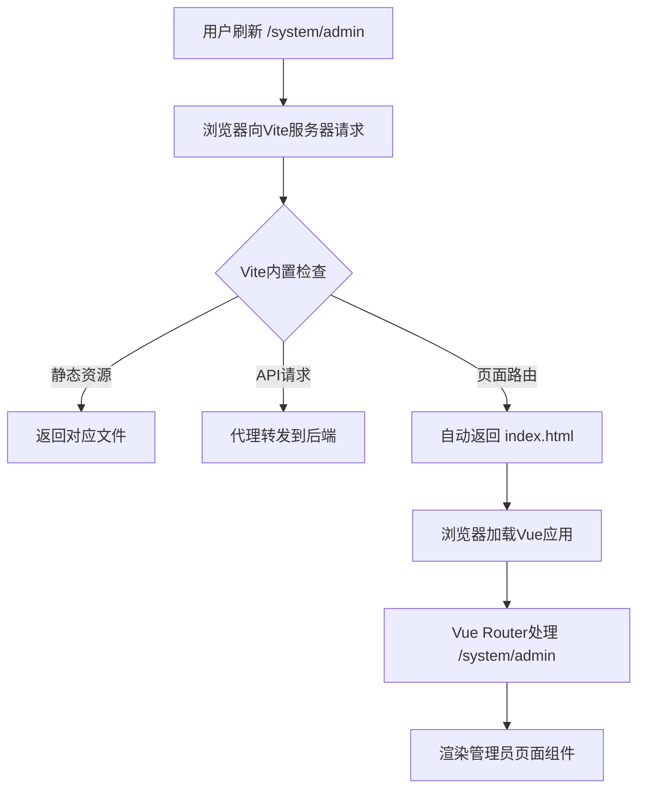

# Vue SPA 刷新白屏问题解析与解决方案

## 问题描述

在mall后台管理系统中，用户在管理员管理、角色管理等页面刷新浏览器时可能出现白屏现象。这是Vue单页应用(SPA)中的典型问题。

## 问题原因深度分析

### 1. SPA路由机制与传统页面的差异

#### 传统多页应用 vs SPA
```
传统多页应用：
- 每个URL对应服务器上的实际文件
- /admin.html, /role.html 等都是真实存在的文件
- 浏览器直接请求对应的HTML文件

SPA应用：
- 所有路由都由JavaScript管理
- 服务器只有一个入口文件 index.html
- 路由切换通过History API实现，不会向服务器发请求
```

#### 问题发生的具体场景
```
1. 用户访问 http://localhost:8081/dashboard
   → Vite开发服务器返回 index.html
   → Vue Router加载，显示仪表盘组件

2. 用户点击"管理员管理"链接，URL变为 http://localhost:8081/system/admin
   → 这是通过History API实现的前端路由跳转
   → 不会向服务器发送请求

3. 用户在 /system/admin 页面按F5刷新
   → 浏览器向服务器请求 http://localhost:8081/system/admin
   → 如果服务器没有正确配置，会找不到对应的文件
   → 返回 404 错误，页面白屏
```

### 2. Vite开发服务器的默认行为

**好消息：Vite默认已经支持SPA路由回退！**

Vite开发服务器会自动处理以下情况：
- 根路径 `/` → 返回 `index.html`
- 静态资源路径（如 `/assets/*`）→ 返回对应文件
- API代理路径（如 `/api/*`）→ 转发到后端服务器
- **所有其他路径** → 自动回退到 `index.html`（这是关键！）

### 3. 可能的问题来源

如果仍然出现刷新白屏问题，通常是由以下原因造成的：

#### A. 路由守卫中的异步加载问题

```typescript
// 路由守卫执行流程
router.beforeEach(async (to, from, next) => {
  // 1. 检查token
  if (token) {
    // 2. 如果没有用户信息，需要重新获取
    if (!authStore.userInfo) {
      // 3. 异步获取用户信息和权限
      await authStore.initAuth();
      await authStore.getUserPermissionsAction();
      
      // 4. 动态添加路由
      const accessRoutes = permissionStore.generateRoutes();
      accessRoutes.forEach(route => {
        router.addRoute(route);
      });
      
      // 5. 关键问题：路由添加后的跳转处理
      next(); // ❌ 可能导致路由未完全添加就跳转
    }
  }
});
```

#### B. 权限检查或API请求失败

```typescript
// 刷新页面时，如果权限检查失败或API请求失败
// 可能导致路由守卫阻止页面渲染
if (!hasPermission) {
  next('/403'); // 被重定向到无权限页面
  return;
}
```

#### C. 状态管理问题

```typescript
// Pinia store在页面刷新后状态丢失
// 如果没有正确恢复状态，可能导致组件渲染失败
const authStore = useAuthStore();
if (!authStore.userInfo) {
  // 需要重新初始化用户信息
}
```

## Vite中的正确配置方法

### 1. 标准的Vite配置（无需额外配置）

```typescript
// vite.config.ts - 正确的配置
export default defineConfig(({ command, mode }) => {
  const env = loadEnv(mode, process.cwd(), '')
  
  return {
    plugins: [vue()],
    
    resolve: {
      alias: {
        '@': resolve(__dirname, 'src'),
      },
    },
    
    server: {
      port: 8081,
      host: true,
      open: true,
      // ✅ Vite默认就支持SPA路由回退，无需额外配置
      proxy: {
        '/api': {
          target: env.VITE_API_BASE_URL || 'http://localhost:3000',
          changeOrigin: true,
        }
      }
    }
  }
})
```

**重要说明：** 
- ❌ 不要添加 `historyApiFallback: true`（这是Webpack配置，不是Vite配置）
- ✅ Vite默认就支持SPA应用的路由回退
- ✅ 当访问不存在的路径时，Vite会自动返回 `index.html`

### 2. Vite的SPA支持原理



## 解决刷新白屏的正确方法

### 1. 优化路由守卫的异步处理

#### 修复路由守卫中的异步问题

```typescript
// ✅ 正确的路由守卫处理
router.beforeEach(async (to, from, next) => {
  const authStore = useAuthStore();
  const permissionStore = usePermissionStore();
  
  // 获取token
  const token = authStore.token;
  
  if (token) {
    if (to.path === '/login') {
      next('/dashboard');
      return;
    }
    
    // 如果没有用户信息，重新获取
    if (!authStore.userInfo) {
      try {
        // 重新获取用户信息和权限
        await authStore.initAuth();
        await authStore.getUserPermissionsAction();
        
        // 生成动态路由
        const accessRoutes = permissionStore.generateRoutes();
        accessRoutes.forEach(route => {
          router.addRoute(route);
        });
        
        // 🔥 关键修复：重新导航到目标路由
        next({ ...to, replace: true });
        return;
      } catch (error) {
        console.error('获取用户信息失败:', error);
        // 清除token并重定向到登录页
        authStore.logout();
        next('/login');
        return;
      }
    }
    
    // 检查页面权限
    if (to.meta?.permissions && Array.isArray(to.meta.permissions) && to.meta.permissions.length > 0) {
      const hasPermission = permissionStore.hasAnyPermission(to.meta.permissions);
      if (!hasPermission) {
        next('/403');
        return;
      }
    }
    
    next();
  } else {
    // 未登录，重定向到登录页
    if (to.path !== '/login') {
      next('/login');
    } else {
      next();
    }
  }
});
```

#### next()函数的正确用法

```typescript
// 1. 正常通过
next();
// 效果：继续当前的导航

// 2. 重定向到新路径
next('/login');
// 效果：取消当前导航，跳转到新路径

// 3. 重新导航到当前路径（刷新后动态路由添加的情况）
next({ ...to, replace: true });
// 效果：取消当前导航，重新导航到目标路径
// replace: true 避免在历史记录中留下记录
```

### 2. 完善状态持久化

#### 在Pinia store中实现状态恢复

```typescript
// auth.store.ts
export const useAuthStore = defineStore('auth', () => {
  const token = ref<string>('');
  const userInfo = ref<UserInfo | null>(null);
  
  // 初始化时从localStorage恢复状态
  const initAuth = async () => {
    const savedToken = localStorage.getItem('token');
    if (savedToken) {
      token.value = savedToken;
      
      // 如果有token但没有用户信息，重新获取
      if (!userInfo.value) {
        try {
          const response = await getUserInfo();
          userInfo.value = response.data;
        } catch (error) {
          // token可能已过期，清除本地存储
          logout();
          throw error;
        }
      }
    }
  };
  
  // 登录成功后保存状态
  const loginAction = async (loginData: LoginRequest) => {
    try {
      const response = await login(loginData);
      token.value = response.data.token;
      userInfo.value = response.data.userInfo;
      
      // 持久化到localStorage
      localStorage.setItem('token', token.value);
      return true;
    } catch (error) {
      return false;
    }
  };
  
  // 登出时清除状态
  const logout = () => {
    token.value = '';
    userInfo.value = null;
    localStorage.removeItem('token');
  };
  
  return {
    token,
    userInfo,
    initAuth,
    loginAction,
    logout
  };
});
```

### 3. 处理异步组件加载问题

#### 使用Suspense组件

```vue
<!-- App.vue -->
<template>
  <div id="app">
    <Suspense>
      <template #default>
        <router-view />
      </template>
      <template #fallback>
        <div class="loading">
          <el-loading-directive v-loading="true" text="加载中..." />
        </div>
      </template>
    </Suspense>
  </div>
</template>
```

#### 添加错误边界处理

```vue
<!-- ErrorBoundary.vue -->
<template>
  <div v-if="hasError" class="error-boundary">
    <el-result
      icon="error"
      title="页面加载失败"
      sub-title="请刷新页面重试"
    >
      <template #extra>
        <el-button type="primary" @click="reload">刷新页面</el-button>
      </template>
    </el-result>
  </div>
  <slot v-else />
</template>

<script setup lang="ts">
import { ref, onErrorCaptured } from 'vue';

const hasError = ref(false);

onErrorCaptured((error) => {
  console.error('组件渲染错误:', error);
  hasError.value = true;
  return false;
});

const reload = () => {
  window.location.reload();
};
</script>
```

## 生产环境部署注意事项

### 1. Nginx配置

```nginx
server {
  listen 80;
  server_name your-domain.com;
  root /path/to/your/dist;
  index index.html;

  # SPA路由回退配置
  location / {
    try_files $uri $uri/ /index.html;
  }

  # API请求代理
  location /api/ {
    proxy_pass http://your-backend-server:3000;
    proxy_set_header Host $host;
    proxy_set_header X-Real-IP $remote_addr;
  }

  # 静态资源缓存
  location ~* \.(js|css|png|jpg|jpeg|gif|ico|svg)$ {
    expires 1y;
    add_header Cache-Control "public, immutable";
  }
}
```

### 2. Apache配置

```apache
<IfModule mod_rewrite.c>
  RewriteEngine On
  RewriteBase /
  RewriteRule ^index\.html$ - [L]
  RewriteCond %{REQUEST_FILENAME} !-f
  RewriteCond %{REQUEST_FILENAME} !-d
  RewriteRule . /index.html [L]
</IfModule>
```

## 调试方法

### 1. 开发环境调试

```typescript
// 在路由守卫中添加调试日志
router.beforeEach(async (to, from, next) => {
  console.log('路由守卫触发:', {
    to: to.path,
    from: from.path,
    hasToken: !!authStore.token,
    hasUserInfo: !!authStore.userInfo
  });
  
  // ... 其他逻辑
});
```

### 2. 检查网络请求

在浏览器开发者工具的Network面板中检查：
- 页面刷新时是否正确返回了 `index.html`
- API请求是否正常
- 静态资源是否加载成功

### 3. 状态检查

```typescript
// 在组件中检查状态
onMounted(() => {
  console.log('组件挂载时的状态:', {
    route: route.path,
    token: authStore.token,
    userInfo: authStore.userInfo,
    permissions: permissionStore.permissions
  });
});
```

## 最佳实践总结

### 1. Vite配置
- ✅ 使用Vite默认的SPA支持，无需额外配置
- ✅ 正确配置API代理
- ❌ 不要使用 `historyApiFallback`（这是Webpack配置）

### 2. 路由守卫设计
- ✅ 正确处理异步权限加载
- ✅ 使用 `next({ ...to, replace: true })` 重新导航
- ✅ 添加错误处理和重试机制

### 3. 状态管理
- ✅ 实现状态持久化
- ✅ 页面刷新时的状态恢复
- ✅ 错误边界处理

### 4. 生产部署
- ✅ 配置Web服务器的SPA路由回退
- ✅ 设置合适的缓存策略
- ✅ 监控和日志记录

## 技术栈说明

- **Vite**: 现代前端构建工具，内置SPA支持
- **Vue Router**: Vue.js官方路由管理器，支持History模式
- **History API**: 浏览器原生API，用于SPA路由
- **Pinia**: Vue.js状态管理，支持持久化
- **TypeScript**: 类型安全的JavaScript

通过以上正确的配置和处理方式，确保Vue SPA应用在任何路径下刷新都能正常工作，无需错误的 `historyApiFallback` 配置。 